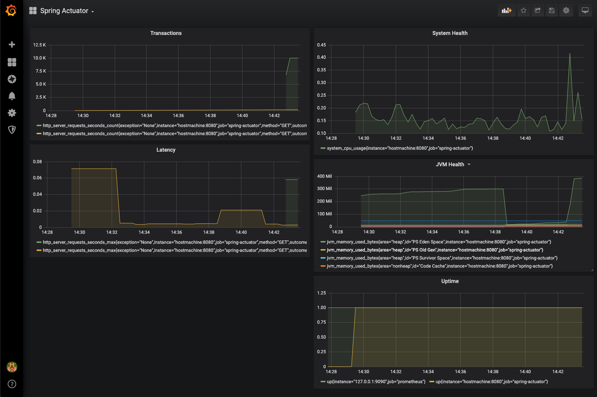

# API Demo Project

## Getting Started

Simple git clone, change dir and run

```bash

git clone https://github.com/yogendra/api-demo.git
cd apidemo
./mvnw spring-boot:run

```

Build docker image

```bash

./mvnw spring-boot:build-image

```

Push docker image

```bash
docker push ghcr.io/yogendra/api-demo:latest
```

## Monitoring

Test application monitoring using local Prometheus and Grafana.



- Run Prometheus locally

    ```bash
    docker run -d --rm\
        --add-host hostmachine:$(ipconfig getifaddr en0) \
        -p 9090:9090 \
        -v $PWD/monitoring/prometheus/prometheus.yml:/etc/prometheus/prometheus.yml \
        --name prometheus \
        --hostname prometheus \
        prom/prometheus \
        --config.file=/etc/prometheus/prometheus.yml
    ```

- Run Grafana locally

    ```bash
    docker run --rm -d \
        --name=grafana \
        --link prometheus:prometheus \
        -v $PWD/monitoring/grafana/dashboards:/var/lib/grafana/dashboards \
        -v $PWD/monitoring/grafana/provisioning:/etc/grafana/provisioning \
        -v $PWD/monitoring/grafana/config.ini:/etc/grafana/config.ini \
        -p 3000:3000 \
        grafana/grafana 
    ```

## Logging

TODO


### Reference Documentation

For further reference, please consider the following sections:

- [Official Apache Maven documentation](https://maven.apache.org/guides/index.html)
- [Spring Boot Maven Plugin Reference Guide](https://docs.spring.io/spring-boot/docs/2.2.6.RELEASE/maven-plugin/)
- [Spring Boot DevTools](https://docs.spring.io/spring-boot/docs/2.2.6.RELEASE/reference/htmlsingle/#using-boot-devtools)
- [Spring Configuration Processor](https://docs.spring.io/spring-boot/docs/2.2.6.RELEASE/reference/htmlsingle/#configuration-metadata-annotation-processor)
- [Spring Web](https://docs.spring.io/spring-boot/docs/2.2.6.RELEASE/reference/htmlsingle/#boot-features-developing-web-applications)
- [Spring Data JPA](https://docs.spring.io/spring-boot/docs/2.2.6.RELEASE/reference/htmlsingle/#boot-features-jpa-and-spring-data)
- [Spring Boot Actuator](https://docs.spring.io/spring-boot/docs/2.2.6.RELEASE/reference/htmlsingle/#production-ready)

### Guides

The following guides illustrate how to use some features concretely:

- [Building a RESTful Web Service](https://spring.io/guides/gs/rest-service/)
- [Serving Web Content with Spring MVC](https://spring.io/guides/gs/serving-web-content/)
- [Building REST services with Spring](https://spring.io/guides/tutorials/bookmarks/)
- [Accessing Data with JPA](https://spring.io/guides/gs/accessing-data-jpa/)
- [Building a RESTful Web Service with Spring Boot Actuator](https://spring.io/guides/gs/actuator-service/)
- [Accessing data with MySQL](https://spring.io/guides/gs/accessing-data-mysql/)
