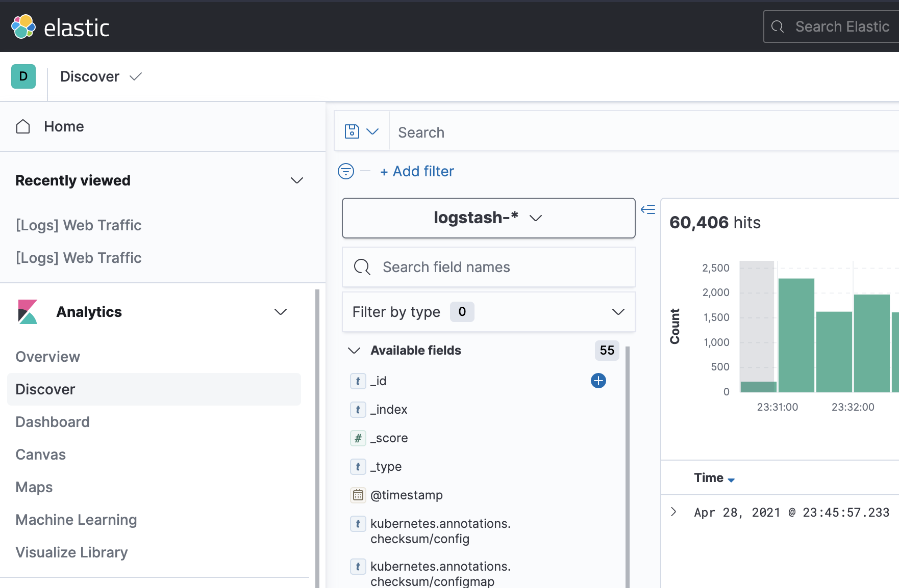

# Setup Cluster

1. Patch Service Account with Docker credentials

    ```bash
    script/add-image-pull-credentials.sh    
    ```

    *Sample Output*

    ```bash
    Docker registry credential name (used for secret object name): ghcr
    Service acount to patch: default
    Docker Registry Server (Example: ghcr.io, docker.io, harbor.mycluster.com): ghcr.io
    Docker Registry Username : yogendra
    Docker Registry User Email : yogendrarampuria@gmail.com
    Docker Registry Password : 
    Creating ghcr for docker registry ghcr.io
    secret/ghcr created
    serviceaccount/default patched
    ```

1. Allow privileged/run as root containers containers

    ```bash
    kubectl create clusterrolebinding privileged-cluster-role-binding \
        --clusterrole=vmware-system-privileged \
        --group=system:authenticated
    ```

1. Create a privileged PSP and Cluser Role

    ```bash
    kubectl apply -f setup/privileged-psp.yaml
    ```

1. Install Metrics Server

    ```bash
    kubectl apply -f setup/metrics-server.yaml
    ```

1. Install cert-manager

    ```bash
    kubectl apply -f  setup/cert-manager.yaml
    ```

    1. Install lets encrypt issuers

        ```bash
        kubectl apply -f setup/letsencrypt.yaml
        ```

1. Install contour

    ```bash
    kubectl apply -f setup/contour.yaml
    ```

    1. Update DNS record

        ```bash
        AWS_HOSTED_ZONE_ID=Z05688932VSDMPEHGAGKB
        CLUSTER_INGRESS_DOMAIN=techtalk.cna-demo.ga
        script/update-route53.sh $AWS_HOSTED_ZONE_ID $CLUSTER_INGRESS_DOMAIN
        ```

1. Install Harbor

    1. Add Helm repository

        ```bash
        helm repo add harbor https://helm.goharbor.io
        ```

    1. Create namespace

        ```bash
        kubectl create ns harbor
        ```

    1. Install harbor with helm chart

        ```bash
        helm install registry harbor/harbor -f setup/harbor.yaml -n harbor
        ```

1. Install log aggregation system - Elastic,Fluent bit and Kibana (EFK)

    1. Install Elastic Operator

        ```bash
        kubectl apply -f setup/elastic-operator.yaml
        ```

    1. Check status of elastic operator

        ```bash
        kubectl -n elastic-system logs -f statefulset.apps/elastic-operator
        ```

    1. Create Elastic and Kibana deployments

        ```bash
        kubectl apply -f setup/elastic.yaml
        ```

    1. Get elastic password

        *mac copy*

        ```bash
        kubectl get secret logging-es-elastic-user -o go-template='{{.data.elastic | base64decode}}' | pbcopy        
        ```

         *bash*

        ```bash
        PASSWORD=$(kubectl get secret logging-es-elastic-user -o go-template='{{.data.elastic | base64decode}}')
        ```

        *fish*

        ```bash
        PASSWORD=(kubectl get secret logging-es-elastic-user -o go-template='{{.data.elastic | base64decode}}')
        ```

    1. Quick test elastic

        ```bash
        curl -u "elastic:$PASSWORD" https://logs.techtalk.cna-demo.ga  
        ```

        *Output:*

        ```json
        {
            "name" : "logging-es-default-0",
            "cluster_name" : "logging",
            "cluster_uuid" : "WjC0eysITUq9qHSscPdlPw",
            "version" : {
                "number" : "7.12.1",
                "build_flavor" : "default",
                "build_type" : "docker",
                "build_hash" : "3186837139b9c6b6d23c3200870651f10d3343b7",
                "build_date" : "2021-04-20T20:56:39.040728659Z",
                "build_snapshot" : false,
                "lucene_version" : "8.8.0",
                "minimum_wire_compatibility_version" : "6.8.0",
                "minimum_index_compatibility_version" : "6.0.0-beta1"
            },
            "tagline" : "You Know, for Search"
        }
        ```

    1. Quick test [Kibana](https://log-ui.techtalk.cna-demo.ga/). User the `elastic` username and password from earlier steps.

    1. Create fluentbit user

        ```bash
        kubectl exec -n elastic pod/logging-es-default-0 -c elasticsearch -it -- elasticsearch-users useradd fluentbit -p "VMware1!" -r superuser
        ```

    1. Install fluentbit

        ```bash
        kubectl apply -f setup/fluent-bit.yaml
        ```

    1. Configure Kibana
        1. Go to [Kibana/Management/Stack Management/Kibana/Index Pattern/Create index pattern](https://log-ui.techtalk.cna-demo.ga/app/management/kibana/indexPatterns/create)
        1. Login with `elastic` user and setup log dashboard
        1. Enter **Index pattern name** as `logstash-*`
        1. Click **Next**
        1. On Step 2, select **Time field** as `@timestamp`
        1. Click **Create index pattern**
        1. Now go to [Kibana/Analytics/Discover](https://log-ui.techtalk.cna-demo.ga/app/discover)
        1. Select `logstash-*` index in the index patter box

            

1. Install Monitoring - Prometheus and Grafans

    1. create namespace

        ```bash
        kubectl create namespace prometheus
        ```

    1. Install prometheus operator via helm

        ```bash
        helm install prometheus stable/prometheus-operator --namespace prometheus
        ```

    1. Check the installation

        ```bash
        kubectl port-forward -n prometheus prometheus-prometheus-prometheus-oper-prometheus-0 9090
        ```

        Open browser at [http://localhost:9090/](http://localhost:9090/)

    1. Check grafan

        ```bash
        kubectl port-forward -n prometheus prometheus-grafana-5c5885d488-b9mlj 3000
        ```

        Get password form the secret

        **mac copy**

        ```bash
        kubectl get secret --namespace prometheus prometheus-grafana -o go-template='{{index  .data "admin-password"| base64decode }}' | pbcopy
        ```

All Set! Goto [Demo Guide](README)


References:

* [Prometheus Operator in Kubernetes](https://www.magalix.com/blog/monitoring-of-kubernetes-cluster-through-prometheus-and-grafana)
* [Fluent-bit configuration](https://docs.fluentbit.io/manual/pipeline/outputs/elasticsearch#configuration-file)
* [Elastic Quickstart](https://www.elastic.co/guide/en/cloud-on-k8s/current/k8s-quickstart.html)
* [Metrics Server](https://github.com/kubernetes-sigs/metrics-server)
* [Cert Manager](https://github.com/jetstack/cert-manager)
* [Contour Installation](https://projectcontour.io/getting-started/)
